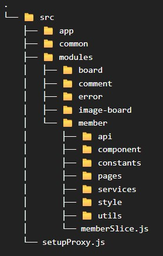

# BoardProject_React

<br/>
<br/>

## 프로젝트 개요

### 프로젝트 목적
- React 환경의 Frontend 구축을 통해 SPA 동작 이해
- 프로젝트 표준 규격의 분리된 Frontend 구축으로 다양한 환경의 테스트 수행 시 재사용
- 분리된 환경에서의 정상적인 통신, 예외처리에 대한 대응 경험

<br/>

### 프로젝트 요약

BoardProject는 새로운 기술 스택을 도입할때 기준점으로 활용하는 테스트베드입니다.   
다양한 백엔드 API를 구현할 때 수정없이 재사용이 가능한 프론트엔드 구축을 목표로 시작한 프로젝트입니다.   
목표를 달성하며 재사용에만 목적을 두는 것이 아닌 SPA에 대한 이해, 동작 흐름 파악, 최적화를 추가 목표로 삼고 설계했습니다.   

<br/>

## 목차
<strong>1. [개발 환경](#개발-환경)</strong>   
<strong>2. [프로젝트 구조 및 설계 원칙](#프로젝트-구조-및-설계-원칙)</strong>   
<strong>3. [기능 및 특징](#기능-및-특징)</strong>

<br/>

## 개발 환경

- React(CRA)
- Redux Toolkit
- Axios
- bootstrap
- dayjs
- http proxy middleware
- react cookie
- styled components

<br/>

## 프로젝트 구조 및 설계 원칙

프로젝트 구조는 크게 common, modules로 분리했습니다.   
2개 이상의 모듈에서 사용되는 컴포넌트, 유틸의 경우 common으로 분리하는 것을 원칙으로 했습니다.   
common 하위에는 대표적으로 Axios 관련 유틸, 게시글 작성 폼, 페이지네이션, 검색 컴포넌트 등이 있습니다.

modules 하위로는 도메인별로 분리했습니다.   
각 modules 도메인 디렉토리는 목적에 따라 다시 한번 세부적으로 분리했습니다.

- **api:** Axios 요청 담당
- **component:** 도메인 컴포넌트
- **constants:** 도메인 상수
- **pages:** 도메인 페이지 컴포넌트
- **services:** 도메인 서비스 로직
- **style:** 도메인 종속 CSS
- **utils:** 도메인 유틸



<br/>

## 기능 및 특징

<br/>

### 로그인 상태 관리

사용자의 로그인 상태 관리는 Redux Toolkit을 사용해 관리합니다.   
모든 토큰은 httpOnly Cookie로 관리되기 때문에 클라이언트에서 토큰 여부를 직접 확인할 수 없기에 App.js에서 useEffect를 통해 서버로 요청을 전달해 체크하는 방식을 채택했습니다.

<details>
    <summary><strong>✔️ memberSlice.js 코드</strong></summary>

```javascript
import { createSlice } from '@reduxjs/toolkit';

const initialState = {
    loginStatus: false,
    id: null,
    role: null,
    isInitialized: false
}

const memberSlice = createSlice({
    name: 'member',
    initialState,
    reducers: {
        login(state, action) {
            const { userId, role } = action.payload;
            state.loginStatus = true;
            state.id = userId;
            state.role = role;
            state.isInitialized = true;
        },
        logout(state) {
            state.loginStatus = false;
            state.id = null;
            state.role = null;
            state.isInitialized = true;
        }
    }
});

export const { login, logout } = memberSlice.actions;
export default memberSlice.reducer;
```

</details>

Redux가 관리하는 정보 중 필요로 하는건 사용자 아이디와 권한입니다.   
서버에서는 로그인 상태 체크 결과 반환으로 사용자 아이디와 가장 높은 권한을 반환하게 됩니다.

<details>
    <summary><strong>✔️ App.js useEffect 코드</strong></summary>

```javascript
//import ...

const NotInitializedDiv = styled.div`
    display: flex;
    justify-content: center;
    align-items: center;
    height: 100vh;
`

function App() {
    const dispatch = useDispatch();
    const isInitialized = useSelector(state => state.member.isInitialized);
    
    useEffect(() => {
        checkStatus()
            .then((res) => {
                const { userId, role } = res.data.content;
                dispatch(login({ userId, role }))
            })
            .catch((err) => {
                dispatch(logout());
            })
    }, [dispatch]);
    
    if(!isInitialized) {
        return (
            <NotInitializedDiv>
                <div className={"spinner-border text-primary"} role={"status"}>
                    <span className={"sr-only"}>Loading...</span>
                </div>
            </NotInitializedDiv>
        )
    }
    
    return (
        // Route
    )
}

export default App;
```

</details>

각 페이지 컴포넌트에서 로그인 여부 체크는 useSelector를 사용했습니다.

<details>
    <summary><strong>✔️ Login 페이지 컴포넌트 코드</strong></summary>

```javascript
// import ...

function Login() {
    //...
    const isLoggedIn = useSelector((state) => state.member.loginStatus);
    
    useEffect(() => {
        if(isLoggedIn)
            navigate('/');
    }, [isLoggedIn, state]);
    
    //...
}
```

</details>

이런 상태 관리 방식을 통해 명확하게 로그인 상태 관리를 할 수 있고, 새로고침시에도 상태 관리를 유지할 수 있는 환경을 구축했습니다.

<br/>

### Axios 구조 및 Interceptor

Axios는 Simple과 Enhanced 두가지로 분리했습니다.   
Simple의 경우 ResponseInterceptor를 사용하지 않고 있으며, Enhanced만 ResponseInterceptor를 사용하는 구조입니다.

로그인의 경우 정보를 잘못 입력한 경우 403이 발생하게 됩니다.   
이런 경우 '사용자 정보가 일치하지 않습니다.' 라는 문구만 띄워주면 되는 반면, ResponseInterceptor를 사용하면 접근 권한 문제처럼 error 페이지로 이동하기 때문에 직접 제어할 수 있어야 한다고 생각했습니다.   
그래서 직접 제어를 할 수 있는 Simple, ResponseInterceptor를 통해 공통 처리를 하는 Enhanced로 분리해 설계했습니다.

<details>
    <summary><strong>✔️ Axios 설정 코드</strong></summary>

```javascript
// axiosSimple.js
import axios from 'axios';

export const axiosSimple = axios.create({
    baseURL: '/api',
    withCredentials: true,
});

// axiosEnhanced.js
import axios from 'axios';
import { responseInterceptor } from './axiosInterceptor';

export const axiosEnhanced = axios.create({
    baseURL: '/api',
    withCredentials: true,
});

axiosEnhanced.interceptors.response.use(
    res => res,
    responseInterceptor
)
```

</details>

프로젝트 규모와 특징상 ResponseInterceptor는 가볍게 설계하게 되었습니다.

<details>
    <summary><strong>✔️ AxiosInterceptor.js 코드</strong></summary>

```javascript
import { parseResponseCodeAndMessage } from "./responseErrorUtils";

export const responseInterceptor = async (error) => {
    // response 결과에서 code, message만 추출
    const { code, message } = parseResponseCodeAndMessage(error);
    
    if(code === 401) {
        // 토큰 탈취 응답
        alert('로그인 정보에 문제가 발생해 로그아웃됩니다.\n문제가 계속된다면 관리자에게 문의해주세요.');
        window.location.href = '/';
    }else if(code === 403 || code === 404) {
        // 권한 부족 혹은 존재하지 않는 요청 발생시 error 페이지로 전환
        window.location.href = '/error';
    }else if(code === 500) {
        alert('오류가 발생했습니다.\n서비스 이용에 불편을 드려 죄송합니다.\n문제가 계속된다면 관리자에게 문의해주세요.');
        window.location.href = '/';
    }
    
    return Promise.reject(error);
}

```

</details>

이 프로젝트는 토큰의 만료를 클라이언트에게 응답하지 않고 같이 전달된 RefreshToken을 검증하여 자동 재발급 되는 프로세스입니다.   
그렇기 때문에 401이 반환되는 경우는 토큰 탈취, 검증되지 않는 잘못된 토큰이라는 두 가지 케이스로 볼 수 있습니다.   
401이 반환되는 경우 백엔드에서 쿠키를 모두 제거한 상태로 응답을 보내기 때문에 다른 처리는 하지 않으며, location.href를 사용함으로써 상태유지를 초기화하게 됩니다.   
그럼 App.js의 useEffect에 의해 Redux의 상태 관리 또한 다시 체크가 되기 때문에 확실한 로그아웃 및 상태 초기화가 가능합니다.   

403, 404는 일반적으로 정상적인 요청이 아니거나 프론트엔드에서의 처리 누락으로 보여서는 안되는 접근 경로가 노출 되는 경우라고 생각합니다.   
그래서 해당 오류가 발생하는 경우는 단순히 메인페이지로 넘기기보다 error 페이지로 연결하도록 설계했습니다.

500은 주로 백엔드의 장애 상황 발생 또는 특정 기능 누락으로 발생하는 개발 책임이라고 생각해 사용자에게 다른 문구를 보여주도록 해 UX에 안좋은 영향을 최소화 하고자 했습니다.